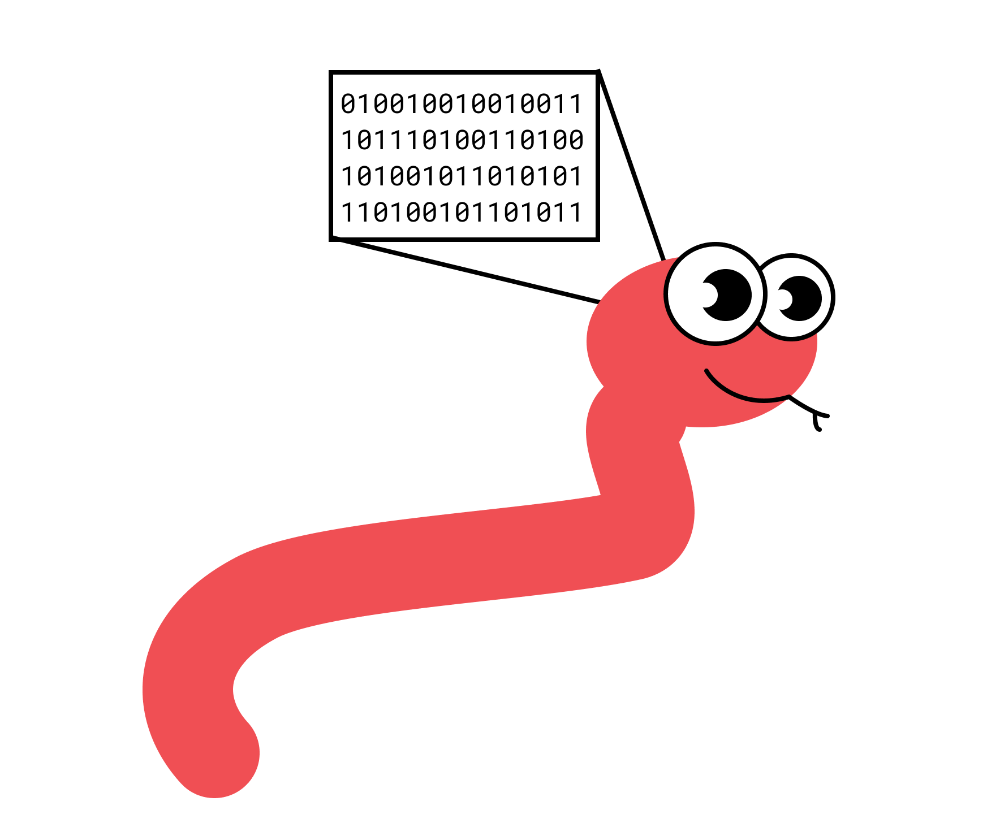

# Snake Game with AI Bot

_This project is a multiplayer browser-based Snake game that utilizes artificial intelligence to train bots to play the game through the application of deep reinforcement learning. The web client is built utilizing the legacy version of Svelte JS and the game server is constructed using the Golang programming language. The bots are trained using the stable baselines 3 library in Python._

- Gameplay video: https://youtu.be/Tj3k8fSNuNA and Single Player AI Bot: https://youtu.be/iaAJbpC_org
- [**Link to Thesis Paper**](https://raw.githubusercontent.com/techboy-coder/snake/master/thesis.pdf)

## Overview

| This project is comprised of three primary components: |  |
| ------------------------------------------------------ | -------------------------------------------------------------------- |

- The web client, which is responsible for rendering the game interface for players.
- The game server, which handles the game logic and facilitates communication between clients.
- The training script, which employs deep reinforcement learning to train the bots to play the game

## Technologies

- Web client: Svelte JS (legacy version) - HTML, CSS, Typescript, Tailwind, Svelte, Canvas Rendering
- Game server: Golang
- Training and Testing script: Python, Stable Baselines 3 (DQNs, ...)

## How to run

To run the project, perform the following steps after cloning the repository:

1. Start the game server: `./server/app`
2. Start the web client: `cd web && npm run dev`
3. Start the training script: `cd core && python runai`.py (Refer to the python file for further instructions); To stop the AI from playing, edit `./core/RUN.txt` to any value other than "OK".

## How to play

To play the game, navigate to the URL displayed in the terminal after starting the web client. Enter a nickname and join the game. If the AI script is running, other players will be present to play against.

## Included:

- Presentation (HTML)
- Thesis: **Teaching bots to play a game using artificial intelligence** - _Applied deep reinforcement learning in a realtime game_

---

Licensed under the MIT License. See LICENSE file in the project root for full license information.

© 2023 - techboy-coder – (https://github.com/techboy-coder)
